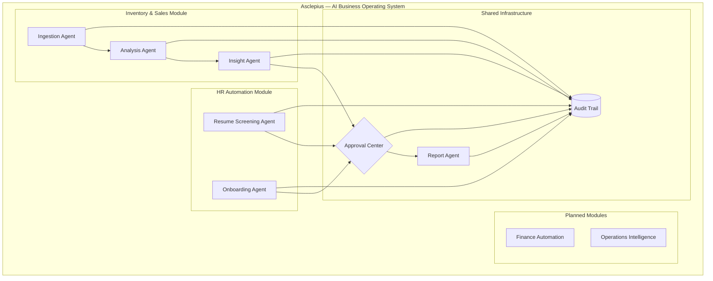
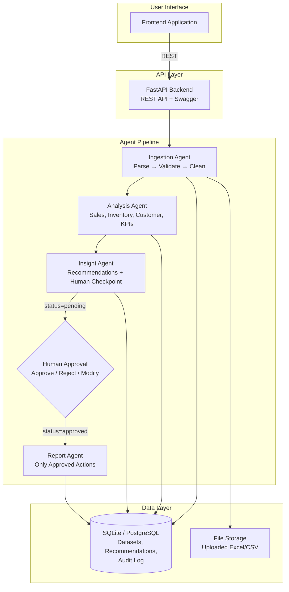
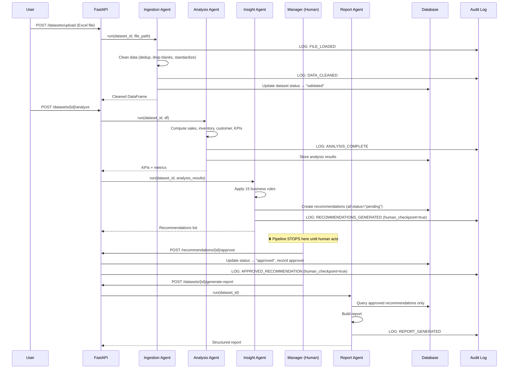
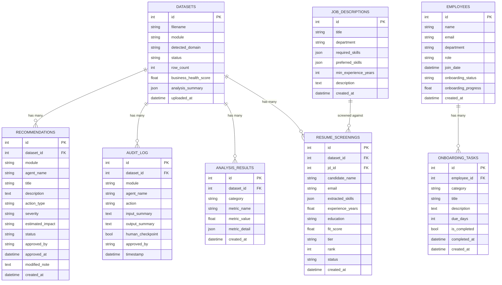

# Architecture Document — Asclepius

## 1. System Overview

Asclepius is a **modular AI Business Operating System** with a six-agent pipeline spanning multiple business departments. Each module (Inventory & Sales, HR Automation, and planned Finance/Operations) follows the same architectural pattern: agents perform deterministic computation, generate recommendations with `status=pending`, and wait for human approval. The system enforces a strict rule: **all numerical computation is deterministic (Pandas/SQL), and LLM is used only for narrative generation**.

### Module Architecture



### High-Level Architecture



### Request Flow (Single Upload-to-Report Cycle)



## 2. Technology Stack

| Layer | Technology | Version |
|-------|-----------|---------|
| Backend API | FastAPI | 0.111.x |
| Language | Python | 3.11+ |
| ORM | SQLAlchemy | 2.0.x |
| Database | SQLite (dev) / PostgreSQL (prod) | 3.x / 15.x |
| Data Processing | Pandas, NumPy | 2.2.x |
| ML | scikit-learn (Isolation Forest, KMeans) | 1.5.x |
| LLM | Google Gemini (narrative generation only) | API |
| Testing | pytest, httpx (TestClient) | 8.x |
| Linting | Ruff | 0.5.x |
| CI/CD | GitHub Actions | — |
| Containerization | Docker, Docker Compose | — |

### Why These Choices (Decisions and Alternatives)

**FastAPI over Flask and Django.**
Flask was considered because the team has prior experience. Rejected because Flask requires manual setup for request validation, API documentation, and async support — all of which FastAPI provides out of the box via Pydantic models and automatic Swagger generation. Django was rejected because its ORM opinions and admin panel add weight we do not need; our data processing lives in Pandas, not Django models.

**SQLite for development, PostgreSQL for production.**
SQLite was chosen for the hackathon build because it requires zero infrastructure setup — no Docker container, no connection string configuration, no service management. The application uses SQLAlchemy as an abstraction layer, so switching to PostgreSQL requires changing one environment variable (`DATABASE_URL`). We ship a `docker-compose.yml` with PostgreSQL for production-like deployment. MongoDB was considered and rejected because our data is inherently relational (datasets have many recommendations, recommendations reference audit logs) and MongoDB would push join logic into application code.

**Pandas over raw SQL for analysis.**
The analysis pipeline operates on uploaded Excel files that are not yet in the database during processing. Pandas can read Excel/CSV directly, perform complex grouped aggregations (ABC classification, RFM scoring), and handle missing data natively. Using raw SQL would require first loading every upload into database tables with dynamic schemas — unnecessary complexity for batch analysis. DuckDB was considered as an alternative analytical engine but rejected to minimize dependencies for the hackathon build.

**Agent pipeline over monolith.**
Each agent (Ingestion, Analysis, Insight, Report) is a separate class inheriting from `BaseAgent`. The alternative was a single `process_file()` function. The agent pattern was chosen for three reasons: (1) each agent logs independently to the audit trail, satisfying the traceability requirement; (2) agents can be tested in isolation; (3) the pipeline can be paused between Insight and Report for human approval — a monolith would require awkward mid-function interrupts.

**Rule-based insights with optional LLM narrative, not LLM for computation.**
The team considered using an LLM (Gemini) to analyze data directly. This was explicitly rejected because LLMs hallucinate numbers. Every metric in Asclepius (revenue, dead stock count, growth %) is computed deterministically by Pandas. The LLM's only role is converting computed facts into readable narrative — it receives structured data and produces text, never the reverse. This is stated in `.clinerules` as a hard architectural rule.

## 3. Data Model

### Entity Relationship Diagram



### Table Descriptions

**Core Tables (shared across all modules):**

**`datasets`** — One row per uploaded file. The `module` field identifies which module owns it (`inventory`, `hr`). Tracks the file through its lifecycle: `uploaded` → `validated` → `analyzed` → `completed`.

**`recommendations`** — AI-generated action items from any module. The `module` field enables cross-module filtering. Every recommendation starts with `status = "pending"`. Only transitions to `approved` or `rejected` via explicit human action.

**`audit_log`** — Append-only log of every agent action and human decision across all modules. The `module` field enables per-module audit views while maintaining a unified timeline.

**`analysis_results`** — Stores computed metrics by category (sales, inventory, customer, kpi). Used by the Inventory module.

**HR Module Tables:**

**`job_descriptions`** — Job descriptions that resumes are screened against. Contains required skills, preferred skills, and minimum experience.

**`resume_screenings`** — One row per candidate per screening run. Stores extracted skills, fit score (0–100), tier (Strong/Moderate/Weak), and rank.

**`employees`** — Employee records for onboarding tracking. Tracks onboarding status and progress percentage.

**`onboarding_tasks`** — Auto-generated checklist items with category, due date, and completion tracking.

## 4. API Endpoints

### Inventory & Sales Module

| Method | Endpoint | Description | Story |
|--------|----------|-------------|-------|
| `POST` | `/datasets/upload` | Upload Excel/CSV, triggers ingestion | US-01 |
| `GET` | `/datasets/` | List all datasets | — |
| `GET` | `/datasets/{id}` | Get dataset details | — |
| `POST` | `/datasets/{id}/analyze` | Run analysis + insight pipeline | US-02, US-03, US-04, US-09, US-10 |
| `GET` | `/datasets/{id}/kpis` | Get KPIs and Business Health Score | US-03 |
| `GET` | `/datasets/{id}/sales` | Get sales analysis results | US-09 |
| `GET` | `/datasets/{id}/inventory` | Get inventory analysis results | US-04 |
| `GET` | `/datasets/{id}/customers` | Get customer analysis results | US-09 |
| `GET` | `/datasets/{id}/priority-queue` | Get top actions ranked by severity | US-05 |
| `POST` | `/datasets/{id}/generate-report` | Generate report from approved items | US-08 |

### HR Automation Module

| Method | Endpoint | Description | Story |
|--------|----------|-------------|-------|
| `POST` | `/hr/job-descriptions` | Create a job description | US-11 |
| `GET` | `/hr/job-descriptions` | List job descriptions | US-11 |
| `POST` | `/hr/screen-resumes?jd_id={id}` | Upload resumes CSV, run screening agent | US-11 |
| `GET` | `/hr/screenings/{id}/results` | Get scored & ranked candidates | US-11 |
| `POST` | `/hr/employees` | Register new employee | US-12 |
| `GET` | `/hr/employees` | List employees | US-12 |
| `POST` | `/hr/employees/{id}/onboard` | Trigger onboarding agent | US-12 |
| `GET` | `/hr/employees/{id}/onboarding` | Get onboarding checklist & progress | US-12 |
| `POST` | `/hr/onboarding-tasks/{id}/complete` | Mark onboarding task complete | US-12 |

### Shared Infrastructure

| Method | Endpoint | Description | Story |
|--------|----------|-------------|-------|
| `GET` | `/modules` | List all business modules | — |
| `GET` | `/recommendations/` | List recommendations (all modules) | US-05 |
| `POST` | `/recommendations/{id}/approve` | Approve a recommendation | US-06 |
| `POST` | `/recommendations/{id}/reject` | Reject a recommendation | US-06 |
| `GET` | `/audit-log` | Get audit trail (spans all modules) | US-07 |
| `GET` | `/health` | Health check | — |

## 5. Folder Structure

```
asclepius-starter/
├── .github/workflows/
│   └── ci.yml                    # GitHub Actions: lint, test, smoke test
├── .clinerules                   # Agent constitution / rules file
├── AGENTS_AND_SKILLS.md          # Custom agents and skills documentation
├── LICENSE                       # MIT License
├── README.md                     # Setup and usage instructions
├── docker-compose.yml            # PostgreSQL + backend services
├── requirements.txt              # Python dependencies
├── backend/
│   ├── Dockerfile
│   ├── requirements.txt
│   ├── app/
│   │   ├── main.py               # FastAPI app, CORS, router mounting, /modules
│   │   ├── models.py             # SQLAlchemy models (core + HR)
│   │   ├── db.py                 # Database engine and session
│   │   ├── api/                  # Route handlers
│   │   │   ├── datasets.py       # Upload, analyze, dataset queries
│   │   │   ├── approvals.py      # Approve/reject recommendations (cross-module)
│   │   │   ├── kpis.py           # KPI and analysis result queries
│   │   │   ├── audit.py          # Audit trail queries (cross-module)
│   │   │   └── hr.py             # HR: JDs, resume screening, onboarding
│   │   ├── agents/               # Core agent pipeline (inventory module)
│   │   │   ├── base_agent.py     # BaseAgent with audit logging
│   │   │   ├── ingestion_agent.py
│   │   │   ├── analysis_agent.py
│   │   │   ├── insight_agent.py
│   │   │   └── report_agent.py
│   │   ├── modules/              # Business module packages
│   │   │   └── hr/               # HR Automation module
│   │   │       ├── analysis.py   # Skill extraction, JD matching, scoring
│   │   │       ├── resume_agent.py    # ResumeScreeningAgent
│   │   │       └── onboarding_agent.py # OnboardingAgent
│   │   ├── analysis/             # Inventory analysis modules
│   │   │   ├── sales.py          # Revenue, rankings, trends
│   │   │   ├── inventory.py      # ABC, dead stock, expiry
│   │   │   ├── customer.py       # RFM, segmentation
│   │   │   └── kpi.py            # Business Health Score
│   │   ├── pipeline/             # Data processing utilities
│   │   └── ml/                   # ML models (anomaly detection)
│   └── tests/
│       ├── conftest.py           # Shared fixtures
│       ├── test_pipeline.py      # Inventory end-to-end smoke tests
│       ├── test_hr.py            # HR module tests
│       └── test_analysis.py      # Analysis module tests
├── docs/
│   ├── ARCHITECTURE.md           # This document
│   ├── PRD.md                    # Product requirements + user stories
│   ├── AUDIT_TRAIL.md            # Audit trail design
│   ├── TASKS.md                  # Task breakdown with story traceability
│   └── PROJECT_BRIEF.md          # Initial project brief
├── frontend/                     # Frontend application (separate build)
└── samples/                      # Sample datasets for testing/demo
    ├── generate_sample_data.py   # Pharma inventory data generator
    ├── generate_hr_data.py       # HR sample data generator
    ├── pharma_distributor_sales.xlsx
    ├── pharma_retail_chemist_sales.csv
    ├── hr_sample_resumes.csv     # 50 pharma industry candidates
    └── hr_sample_jd.json         # Pharma Sales Representative JD
```

## 6. Design Decision: Why Modules?

The alternative was building a monolithic pharma-only application. Modules were chosen for three reasons:

1. **Proves architectural scalability**: The HR module uses the exact same `BaseAgent`, `Recommendation`, and `AuditLog` models as Inventory. No new infrastructure was needed — just new agents plugging into the existing pipeline. This demonstrates that adding Finance or Operations is a matter of writing new agents, not restructuring the application.

2. **Shared approval flow**: Both Inventory recommendations ("Clear dead stock of Glimepiride") and HR recommendations ("Shortlist 8 strong candidates") feed into the same approval queue. A manager sees all pending actions in one place, regardless of department.

3. **Unified audit trail**: The `audit_log` table captures every action from every module. A single query returns the complete decision timeline across departments.

The module boundary is enforced by the `module` field on `Dataset`, `Recommendation`, and `AuditLog`. This is a soft boundary (same database, same API server) appropriate for an SME deployment. For enterprise scale, each module could be extracted into its own microservice with the same API contract.

## 7. Deployment

### Local Development
```bash
cd backend
python3 -m venv venv && source venv/bin/activate
pip install -r requirements.txt
uvicorn app.main:app --reload
```

### Docker (Production-like)
```bash
docker-compose up --build
```

The `docker-compose.yml` runs PostgreSQL 15 and the FastAPI backend. The backend reads `DATABASE_URL` from the environment to switch between SQLite and PostgreSQL.

## 8. Security Considerations

- Uploaded files are stored in a local `uploads/` directory, never in the database
- No raw business data is sent to external LLM APIs — only computed summaries for narrative generation
- API keys are stored in `.env` (gitignored) and never committed
- CORS is configured to allow only the frontend origin in production (currently `*` for development)
- The audit log is append-only by design — no API endpoint exists to delete or modify audit entries